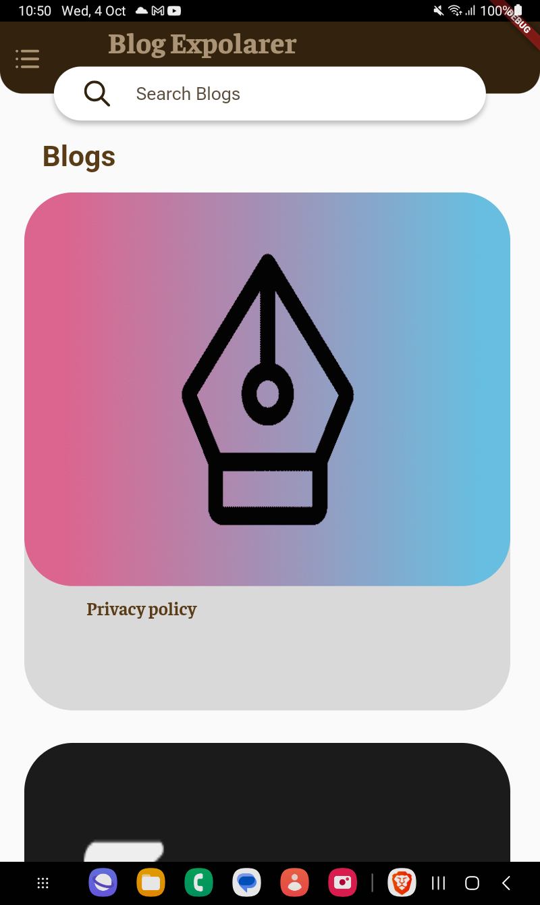
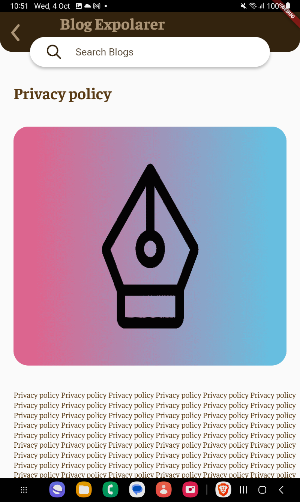
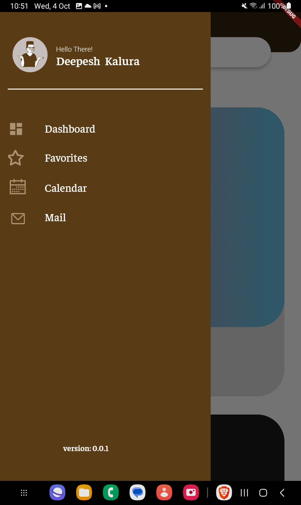
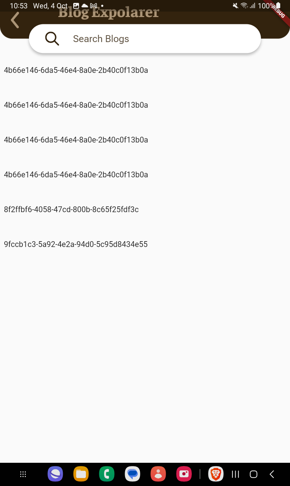

# Blog Explorer

Blog Explorer is a Flutter application that allows users to explore and engage with blogs fetched from a RESTful API. This engaging app provides a user-friendly interface to discover blogs, mark favorites, and explore detailed blog views.

## Completed Tasks

### API Integration
- The app fetches data from the provided API using the following Flutter code:

```dart
import 'dart:convert';

import 'package:flutter/material.dart';
import 'package:http/http.dart' as http;

import '../../model/blog/blog_model.dart';
import '../../model/sqllite/db.dart';

class APIController extends ChangeNotifier {
  static const baseUrl = 'https://intent-kit-16.hasura.app/api/rest/blogs';
  static const adminSecret =
      '32qR4KmXOIpsGPQKMqEJHGJS27G5s7HdSKO3gdtQd2kv5e852SiYwWNfxkZOBuQ6';

  static const headers = {
    'Content-Type': 'application/json',
    'x-hasura-admin-secret': adminSecret,
  };

  bool isLoading = true;
  String errorMessage = "";
  final dbHelper = DatabaseHelper.instance;

  BlogModel blogModel = BlogModel(blogs: []);

  Future<void> fetchBlogs() async {
    try {
      final response = await http.get(Uri.parse(baseUrl), headers: headers);
      if (response.statusCode == 200) {
        final data = json.decode(response.body) as Map<String, dynamic>;
        blogModel = BlogModel.fromMap(data);
      } else {
        errorMessage = response.body;
      }
    } catch (e) {
      errorMessage = e.toString();
    }
    isLoading = false;
    notifyListeners();
  }

  Future<void> fetchBlogsFromDatabase() async {
    final blogs = await dbHelper.queryAllBlogs();
    blogModel = BlogModel(blogs: blogs);
    isLoading = false;
    notifyListeners();
  }
}


```

### Blog List View


- A screen displays a list of blogs.
- Each blog item includes the blog's title and an associated image.
- Tapping on a blog item navigates to a detailed view of that blog.

### Detailed Blog View

- A screen shows the full details of a selected blog, including its title and image.

### Navigation
- Implement navigation between the blog list view and the detailed blog view.

```dart
import 'package:blog_explorer/controller/routes/routes_name_controller.dart';
import 'package:flutter/material.dart';

import '../../view/screen/blog_screen.dart';
import '../../view/screen/detail_screen.dart';
import '../../view/screen/favorite_screen.dart';

class RoutesController {
  static Route<dynamic> onGenratingRoute(RouteSettings settings) {
    switch (settings.name) {
      case RoutesNamesController.blogScreen:
        return MaterialPageRoute(
          builder: (_) => const BlogScreen(),
        );
      case RoutesNamesController.detailScreen:
        final Map arguments = settings.arguments as Map;
        return MaterialPageRoute(
          builder: (_) => DetailScreen(
            title: arguments['title'],
            netWorkImage: arguments['netWorkImage'],
          ),
        );

      case RoutesNamesController.favoriteScreen:
        return MaterialPageRoute(
          builder: (_) => const FavoriteScreen(),
        );
      default:
        return MaterialPageRoute(
          builder: (_) => Scaffold(
            body: Center(
              child: Text('No route defined for ${settings.name}'),
            ),
          ),
        );
    }
  }
}

```

### Interactive Features


- Users can mark a blog as a favorite..

**Note:** Design cannot completed beacuse of the exam.


### State Management
- Utilize Provider as the state management.

```dart

class MyApp extends StatelessWidget {
  const MyApp({super.key});

  @override
  Widget build(BuildContext context) {
    return MultiProvider(
      providers: [
        ChangeNotifierProvider(
          create: (_) => APIController(),
        ),
        ChangeNotifierProvider(
          create: (_) => BlogScreenEventsController(),
        ),
        ChangeNotifierProvider(
          create: (_) => ConnectivityController(),
        ),
      ],
      child: MaterialApp(
        title: 'Blog Explorer',
        theme: ThemeData(
          visualDensity: VisualDensity.adaptivePlatformDensity,
        ),
        onGenerateRoute: RoutesController.onGenratingRoute,
        initialRoute: RoutesNamesController.blogScreen,
      ),
    );
  }
}


```


### Error Handling
- Implement error handling to gracefully manage scenarios where the API is unavailable or returns an error. Display a friendly error message to the user.
    
```dart
Widget getErrorWidget(String errorMessage) {
  return Center(
    child: Text(
      errorMessage,
      style: const TextStyle(
        fontSize: 20.0,
        fontWeight: FontWeight.bold,
        color: Color.fromARGB(0, 255, 0, 0),
      ),
    ),
  );
}

```

### UI/UX Design
- Use Brown Mono colors theme.
- [Create an attractive and user-friendly UI/UX design with the help of figma.](https://www.figma.com/file/p2p5jTQzLTWGRzdGTh93dF/subspace?type=design&node-id=3%3A4&mode=design&t=guQYZZ0OIsk3HOMB-1)

**Note:** You does not have write to change the figma file.


## Bonus (Optional)

### Offline Mode
- Implement offline support using Flutter's local storage (e.g., SQLite or Hive) to allow users to access and interact with blogs even when they are not connected to the internet.
    
```dart
import 'dart:io';
import 'package:path/path.dart';
import 'package:sqflite/sqflite.dart';
import 'package:path_provider/path_provider.dart';

import '../blog/blog.dart';

class DatabaseHelper {
  static const _databaseName = "blog_database.db";
  static const _databaseVersion = 1;

  static const table = 'blogs';

  static const columnId = 'id';
  static const columnImageUrl = 'image_url';
  static const columnTitle = 'title';

  // Make this a singleton class
  DatabaseHelper._privateConstructor();
  static final DatabaseHelper instance = DatabaseHelper._privateConstructor();

  static Database? _database;

  Future<Database> get database async {
    if (_database != null) return _database!;

    _database = await _initDatabase();
    return _database!;
  }

  Future<Database> _initDatabase() async {
    Directory documentsDirectory = await getApplicationDocumentsDirectory();
    String path = join(documentsDirectory.path, _databaseName);
    return await openDatabase(path,
        version: _databaseVersion, onCreate: _onCreate);
  }

  Future _onCreate(Database db, int version) async {
    await db.execute('''
      CREATE TABLE $table (
        $columnId TEXT PRIMARY KEY,
        $columnImageUrl TEXT,
        $columnTitle TEXT
      )
    ''');
  }

  Future<int> insert(Map<String, dynamic> row) async {
    Database db = await instance.database;
    return await db.insert(table, row);
  }

  Future<List<Map<String, dynamic>>> queryAllRows() async {
    Database db = await instance.database;
    return await db.query(table);
  }

  Future<List<Blog>?> queryAllBlogs() async {
    Database db = await instance.database;
    List<Map<String, dynamic>> results = await db.query(table);
    if (results.isEmpty) return null; // No data found
    List<Blog> blogs = results.map((row) => Blog.fromMap(row)).toList();
    return blogs;
  }
}
```

